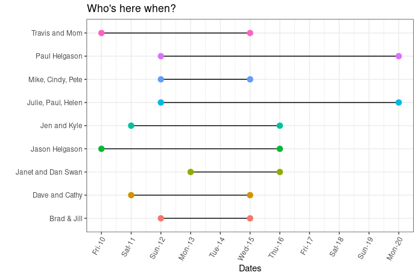
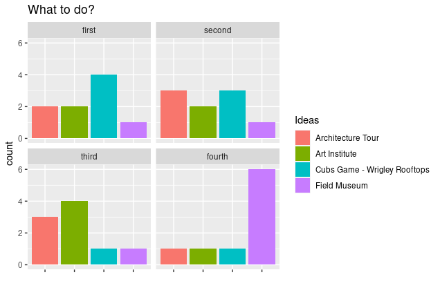
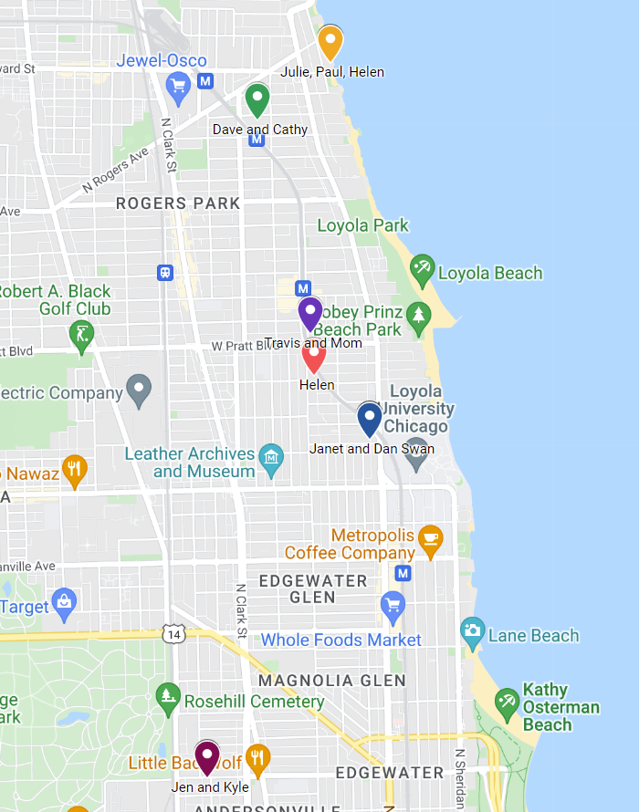

## Timing

•	Saturday June 11th - Hooding ceremony in Evanston on NU campus, Ryan Fieldhouse, 2333 Campus Drive (2pm - 4pm)

•	Sunday June 12th - Nothing (I'll be gone)

•	Monday June 13th - Grad party at Cuneens (1424 W Devon Ave) from 2-5. It is also a cash only bar.

•	Tuesday June 14th - Explore Northwestern and Loyola Campus (morning) and 
  o	Wrigley Rooftops for a 7:05 Cubs game versus the Padres at [Waveland 1048 location](https://www.wrigleyrooftopsllc.com/rooftop/1048%20W%20Waveland)
  
•	Wednesday June 15th – Architecture tour downtown with [Shoreline architecture](https://shorelinesightseeing.com/schedule/?t=1) river tour from Michigan Ave, time TBD.

This is based on data from here:

## Locations

I created a google map collection of where everyone is staying and important places for the trip so if you need an address please look for the link in the email I sent. (I will be updating with restaurant recommendations)

